<!-- markdownlint-disable MD033 -->
<!-- markdownlint-disable MD041 -->
<p align="center">
  
</p>

# Azure Cloud Cost Analyzer


## 🔖 Table of Contents

- [Problem Description](#-problem-description)
- [Objectives](#-objectives)
- [Directory Structure](#-directory-structure)
- [Tools and Technology](#️-tools-and-technology)
- [System Architecture and Flow](#️-system-architecture-and-flow)
- [Entity-Relaionship (ER) Diagram](#-entity-relaionship-er-diagram)
- [Screenshots](#️-screenshots)
- [Setup & Installation](#-setup--installation)
- [Obtaining Azure Credentials](#️-obtaining-azure-credentials)
- [Environment variables (.env)](#️-environment-variables-env)
- [Setting Up SMTP for Email Alerts](#-setting-up-smtp-for-email-alerts)

## 📌 Problem Description

Monitoring Azure cloud costs manually is time-consuming and reactive, making it difficult to identify unexpected spending before the billing cycle ends. Azure Cost Analyzer automates cost collection, threshold monitoring, and email alerting to help users proactively track and control their cloud expenses.

## 🎯 Objectives

- Automate the collection of Azure cost data using the Azure Cost Management API.
- Monitor spending against configurable cost thresholds.
- Generate incident-based email alerts with cooldown logic to avoid duplicate notifications.
- Visualize daily, monthly, and service-wise cost trends through an interactive dashboard.
- Deploy a secure, cloud-native solution using Docker, Azure Container Apps, and Azure Key Vault.

## 📁 Directory Structure

```
Azure Cost Analyzer/
├── README.md
├── backend/                          # FastAPI backend application
│   ├── alembic.ini
│   ├── docker-compose.yml
│   ├── Dockerfile
│   ├── entrypoint.sh
│   ├── pyproject.toml
│   ├── requirements.txt
│   └── app/
│       ├── config.py                 # Application configuration
│       ├── main.py                   # FastAPI application entry point
│       ├── scheduler.py              # Task scheduler for alerts & anomalies
│       ├── alembic/                  # Database migration scripts
│       │   ├── env.py
│       │   ├── README
│       │   ├── script.py.mako
│       │   └── versions/             # Migration history
│       ├── azure/                    # Azure SDK integration
│       │   ├── auth.py               # Azure authentication logic
│       │   └── cost_client.py        # Azure Cost Management API client
│       ├── db/
│       │   ├── database.py           # PostgreSQL connection setup
│       │   ├── models.py             # SQLAlchemy ORM models
│       │   ├── operations.py         # Generic database operations
│       │   └── alert_operations.py   # Alert-specific DB operations
│       ├── exceptions/
│       │   └── cost_exceptions.py    # Custom exception classes
│       ├── handlers/
│       │   └── exception_handlers.py # Global exception handlers
│       ├── models/                   # Pydantic data models
│       │   ├── alert_models.py       # Alert request/response models
│       │   └── cost_models.py        # Cost analysis data models
│       ├── routes/                   # API endpoints
│       │   ├── alert_routes.py       # Alert API routes
│       │   └── cost_routes.py        # Cost analysis API routes
│       ├── services/                 # Business logic & orchestration
│       │   ├── alert_service.py      # Alert management logic
│       │   ├── cache_service.py      # Caching layer for performance
│       │   ├── cost_preprocessor.py  # Data preprocessing pipeline
│       │   ├── cost_service.py       # Cost data fetching & analysis
│       │   ├── cost_tasks.py         # Background task definitions
│       │   └── email_service.py      # Email notification service
│       └── utils/
│           └── responses.py          # Standardized API response helpers
└── frontend/                         # React + TypeScript UI application
    ├── package.json
    ├── tsconfig.json
    ├── vite.config.ts
    ├── tailwind.config.ts
    ├── postcss.config.js
    ├── eslint.config.js
    ├── vitest.config.ts
    ├── components.json
    ├── index.html
    ├── public/
    │   ├── robots.txt
    │   └── staticwebapp.config.json
    └── src/
        ├── App.tsx
        ├── main.tsx
        ├── vite-env.d.ts
        ├── App.css
        ├── index.css
        ├── components/               # Reusable UI components
        │   ├── AppSidebar.tsx
        │   ├── NavLink.tsx
        │   ├── dashboard/            # Dashboard-specific components
        │   └── ui/                   # Shadcn/ui components
        ├── hooks/                    # Custom React hooks
        │   ├── use-cost-data.ts
        │   ├── use-mobile.tsx
        │   └── use-toast.ts
        ├── lib/                      # Utility functions & types
        │   ├── api.ts                # API client configuration
        │   ├── colors.ts             # Color constants
        │   ├── config.ts             # Frontend configuration
        │   ├── types.ts              # TypeScript type definitions
        │   └── utils.ts              # Helper utilities
        ├── pages/                    # Page components
        │   ├── Index.tsx             # Dashboard home page
        │   ├── CostAnalysis.tsx      # Cost analysis page
        │   ├── Budget.tsx            # Budget management page
        │   ├── Reports.tsx           # Reports page
        │   ├── Settings.tsx          # Settings page
        │   └── NotFound.tsx          # 404 page
        └── test/                     # Test files
            ├── example.test.ts
            └── setup.ts
```

## 🛠️ Tools and Technology

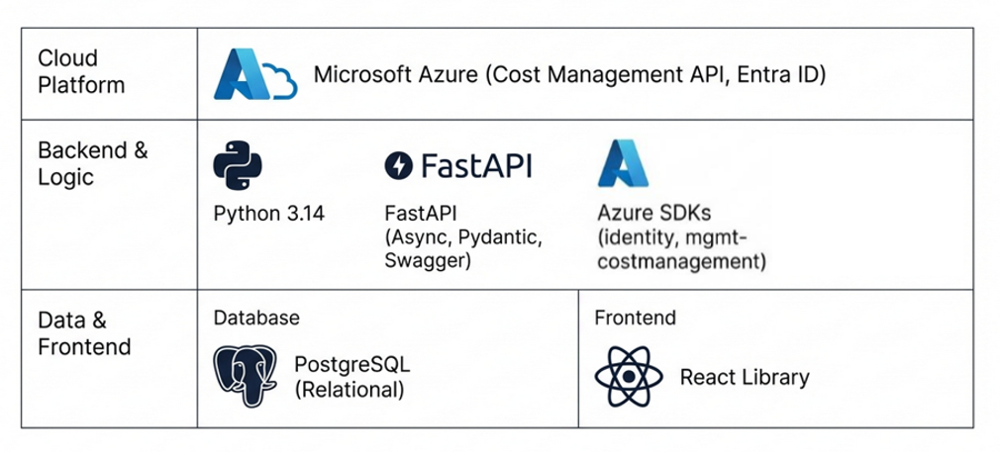

## 🏗️ System Architecture and Flow

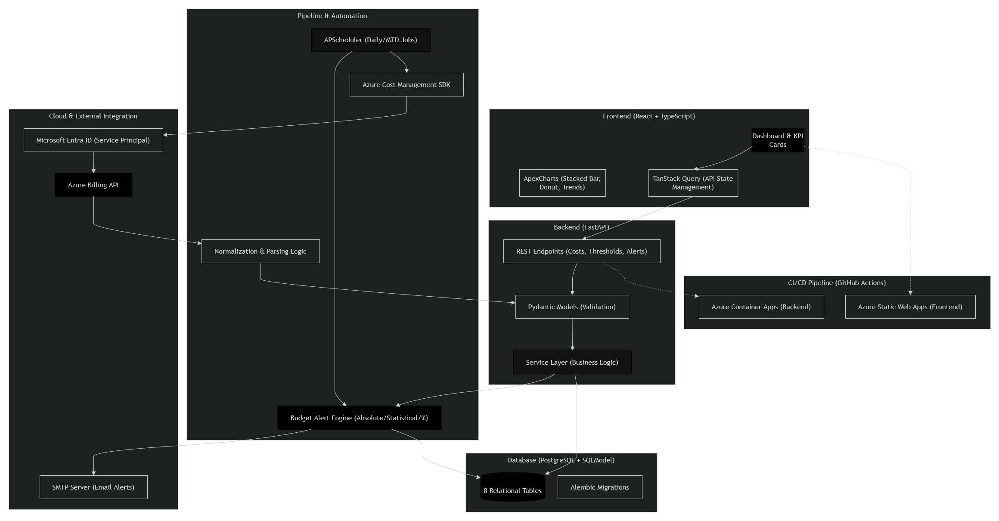

### Step-by-Step Data Flow

**1. Authentication & Data Ingestion:**

- FastAPI backend authenticates with Azure Cost Management API using OAuth 2.0 (Service Principal: client ID + secret + tenant ID).
- Two scheduled jobs trigger ingestion:
  - **Daily Costs Job** → fetches last 7 days cost per service
  - **Service Costs Job** → fetches month-to-date cost per service

**2. Preprocessing:**

- Raw Azure SDK responses are normalized, validated via Pydantic models, and converted into SQLModel entities.

**3. Persistence:**

- Processed cost records are saved to PostgreSQL (`DailyCost`, `ServiceCost`, `BillingPeriod`, `AzureService` tables).

**4. Alert Evaluation:**

- After each successful save, the Alert Engine evaluates thresholds (Absolute / Statistical / Percentage-Based).
- Winning component (max of all) determines breach status.
- Breaches generate `AlertEvent` + `AnomalyLog` entries and trigger SMTP email notifications.

**5. API Exposure:**

- FastAPI serves REST endpoints for costs, thresholds, alerts, anomaly logs, and global anomaly settings.
- ThreadPoolExecutor offloads blocking Azure SDK calls to keep the event loop responsive.

**6. Frontend Consumption:**

- React + TypeScript UI fetches data via TanStack Query (caching, auto-refetch, invalidation).
- Dashboard renders KPI cards, stacked bar / donut / area charts, filter panels, and sortable data tables.

**7. Deployment:**

- Backend → Docker image → Azure Container Registry → Azure Container Apps (via GitHub Actions).
- Frontend → Build → Azure Static Web Apps.

## 📈 Entity-Relaionship (ER) Diagram

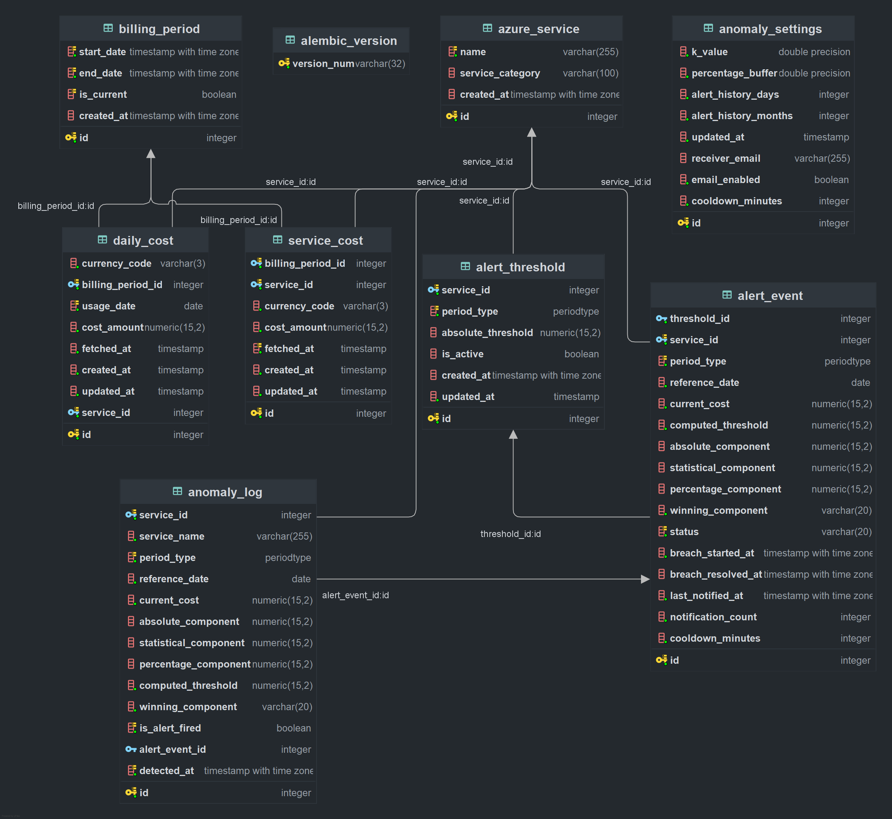

### **There are 8 Normalized tables:**

**1. azure_service** — The central hub. Stores each unique Azure service name (e.g. Virtual Machines, Storage) and its category. Every other table except anomaly_settings references this via FK.

**2. billing_period** — Represents a monthly billing window with start/end dates. The is_current flag marks the active month. Both service_cost and daily_cost link to this.

**3. service_cost** — Stores the month-to-date aggregated cost per service per billing period. One row per service per month. Updated on every scheduled MTD fetch.

**4. daily_cost** — Stores per-day cost per service. One row per service per usage date per billing period. Populated by the daily 7-day fetch job.

**5. alert_threshold** — User-configured budget ceiling per service per period type (daily or monthly). Holds the absolute_threshold in INR and an is_active flag. Unique per (service_id, period_type) pair.

**6. alert_event** — A recorded threshold breach. Created when current cost exceeds the computed threshold. Stores all three threshold components, the winning one, and a status of open or acknowledged. Deduplicated — only one open alert per service+period at a time.

**7. anomaly_log** — Full audit trail of every evaluation run, whether or not an alert fired. Records current cost, all three computed components, and links to the alert_event if one was created. Used for anomaly detection history and debugging.

**8. anomaly_settings** — A singleton config table (always one row, id=1). Stores global parameters for the alert engine: k_value (statistical multiplier), percentage_buffer, alert_history_days, and alert_history_months. Updated via API, no FK relationships.

## 🖼️ Screenshots

### Dashboard

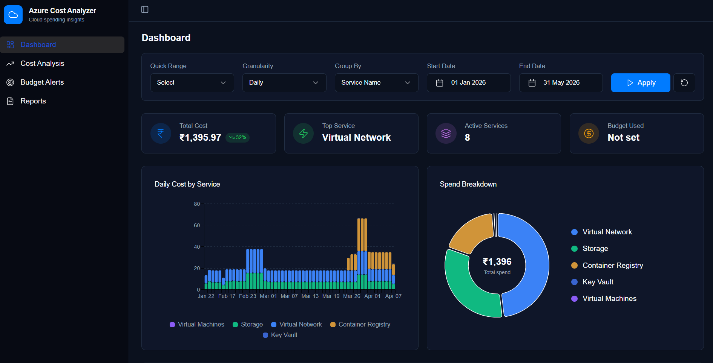
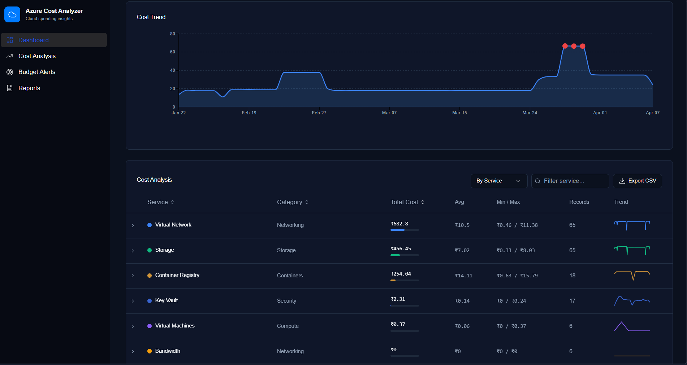

### Cost Analysis Page

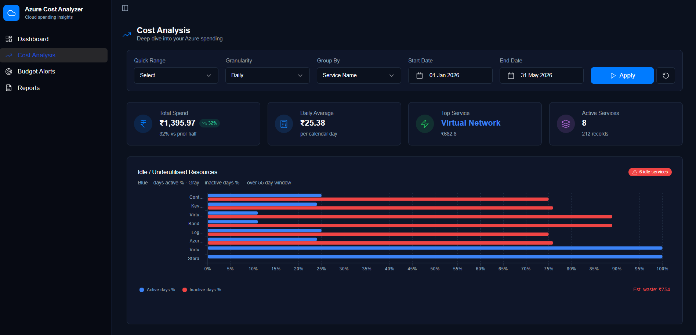
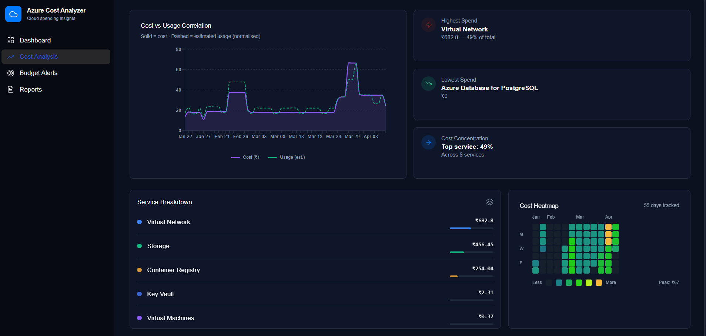

### Budget Alerts Page

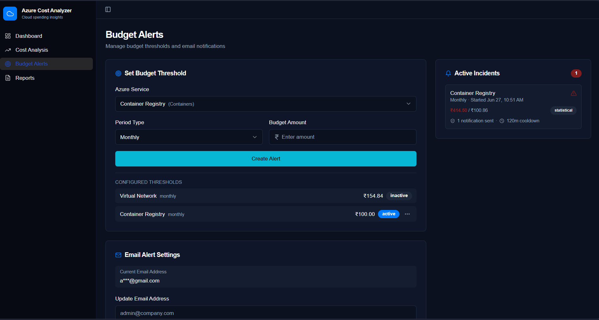
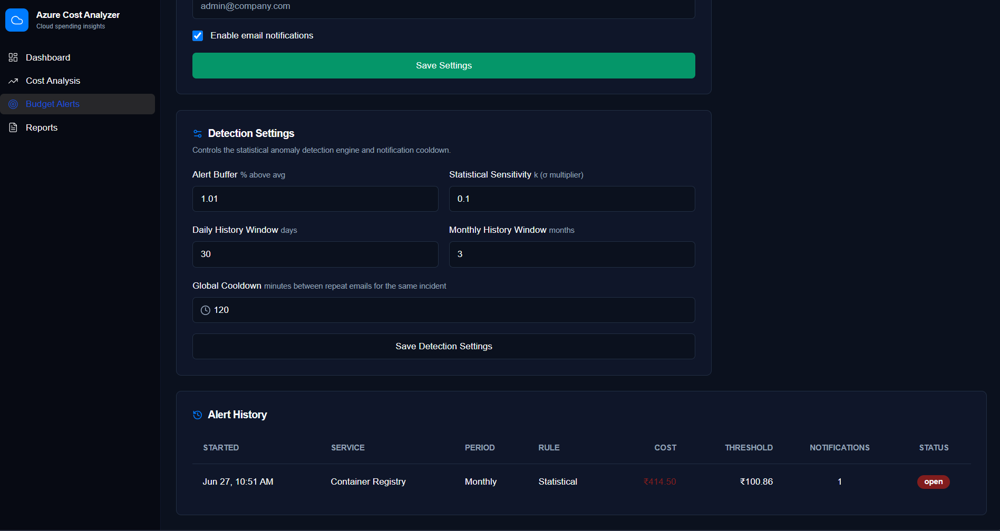

**Email Alert:**
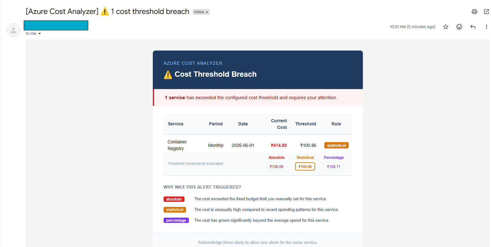

### Reports Page

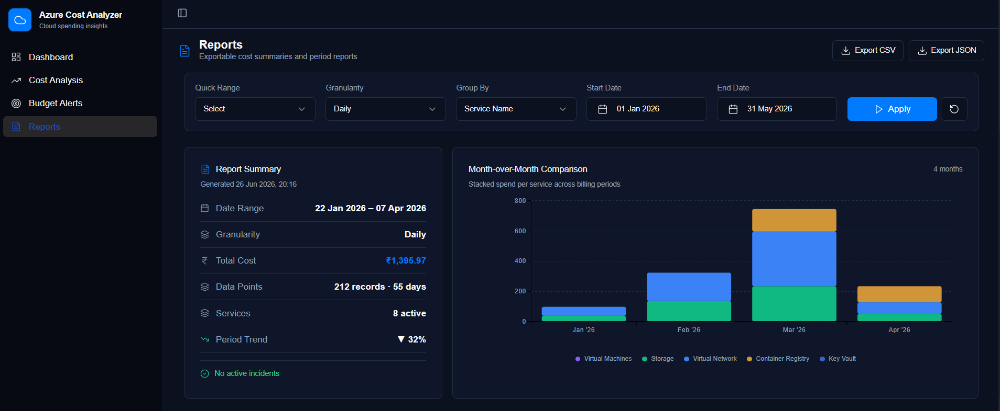
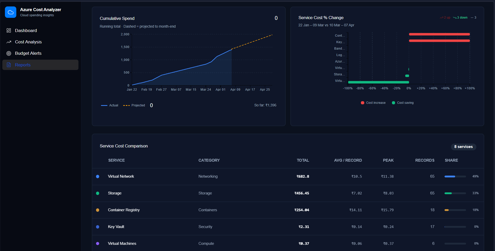

## 🚀 Setup & Installation

### Prerequisites

- Python 3.11+ recommended
- Git installed
- (Optional) Azure CLI for auth workflows

### Option 1: Fast setup with uv (recommended)

```bash
# Install uv if needed
curl -LsSf https://astral.sh/uv/install.sh | sh
# Create and sync environment
uv venv
uv pip install -r requirements.txt
uv run app/main.py
```

### Option 2: Standard virtualenv + pip

```bash
python -m venv .venv
source .venv/bin/activate  # Windows: .venv\Scripts\activate
pip install --upgrade pip
pip install -r requirements.txt
python -m app/main.py
```

## 🛡️ Obtaining Azure Credentials

To use this project, you must have:

- An Azure Subscription
- Billing Reader or Cost Management Reader role on that subscription
- Owner access (only once, to set things up)

### **Step 1: Log in to the Azure Portal**

- Go to <https://portal.azure.com/>

### **Step 2: Register an Application (App Registration)**

- Navigate to "Microsoft Entra ID (Azure AD)" → "App registrations" → "New registration".
- Enter a name (eg: cost-analyzer)
- Supported account types:
Choose

  ```
  Accounts in this organizational directory only (Single tenant)
  ```

- Click Register.

### Step 3: Copy important IDs

  After registration, you land on **Overview page**.

  Copy and save these safely:

  | Field | What it is |
  | --- | --- |
  | **Application (client) ID** | App’s username |
  | **Directory (tenant) ID** | Your Azure organization |
  | **Object ID** | Internal Azure reference |

  You will use:

  Put them in a `.env` file later.

### **Step 4: Create a Client Secret**

- Go to "Certificates & secrets" → "New client secret".
- Add a description and expiry, then click "Add".
- Copy the generated **Value** (this is your `AZURE_CLIENT_SECRET`).

### **Step 5: Get Your Subscription ID**

- In the Azure Portal, search for "Subscriptions".
- Select your subscription and copy the **Subscription ID**.

### **Step 6: Assign Cost Management Reader Role to the App**

- Go to Subscriptions → "Access control (IAM)" → "Add role assignment".
- You'll see a long list of roles. Search for "Cost Management Reader" role → Click Next.
- Select your app (Service Principal):<br>
  i) search by app name or client id<br>
  ii) select it → click Select → click Next

### **Step 7: Review and Assign**

- Review details:<br>
    i) Role: Cost Management Reader<br>
    ii) Scope: Subscription<br>
    iii) Member: Your app<br>
- Click **Assign**

## ⚙️ Environment variables (.env)

Refer the .env.example from both backend and frontend folders. Create a .env file in each and fill in the required values.

## 📧 Setting Up SMTP for Email Alerts

The application supports sending email alerts for budget warnings and anomaly detection. Follow the steps below to configure SMTP:

### **Gmail SMTP Setup**

1. **Enable 2-Step Verification** (if not already enabled):
   - Go to [myaccount.google.com/security](https://myaccount.google.com/security)
   - Enable 2-Step Verification

2. **Generate an App Password**:
   - Go to [myaccount.google.com/apppasswords](https://myaccount.google.com/apppasswords)
   - Select "Mail" and "Windows Computer" (or your device)
   - Click "Generate"
   - Copy the generated 16-character password

3. **Add to .env**:

   ```bash
   SMTP_SERVER=smtp.gmail.com
   SMTP_PORT=587
   SMTP_USERNAME=your-email@gmail.com
   SMTP_PASSWORD=your-16-char-app-password
   SMTP_FROM_EMAIL=your-email@gmail.com
   SMTP_FROM_NAME=Azure Cost Analyzer
   ```

4. **You can also refer to** [How to Configure Gmail SMTP Server Settings](https://dev.to/msnmongare/how-to-configure-gmail-smtp-server-settings-7l6)
